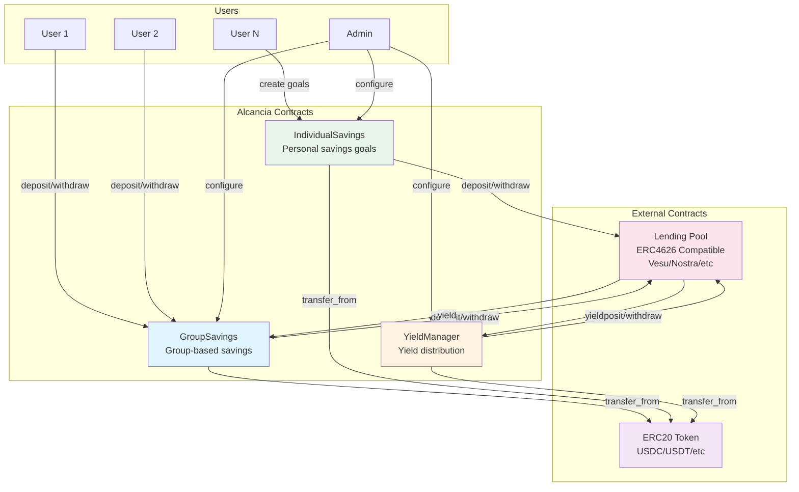
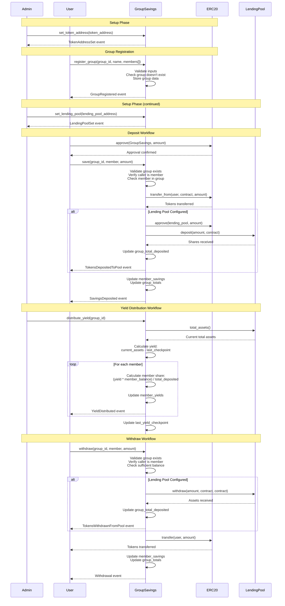
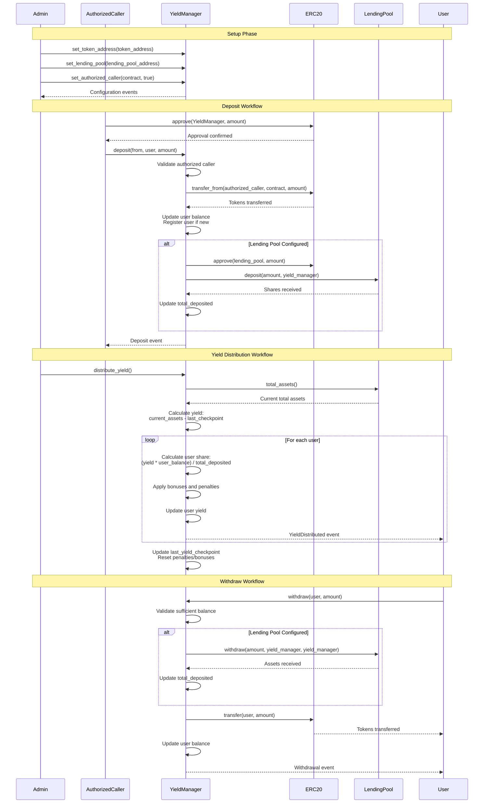
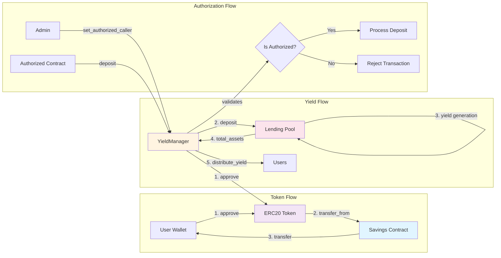
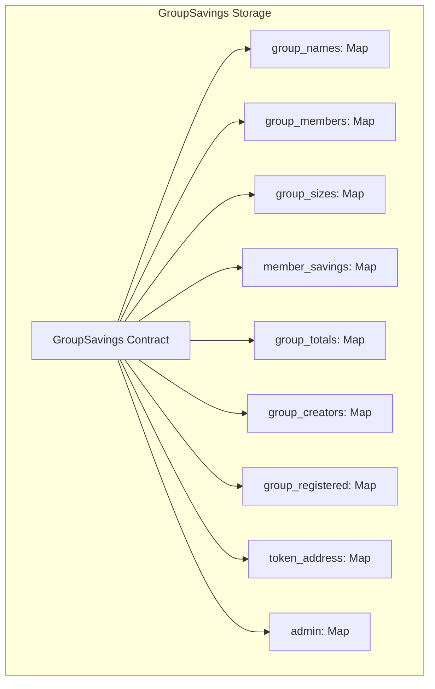
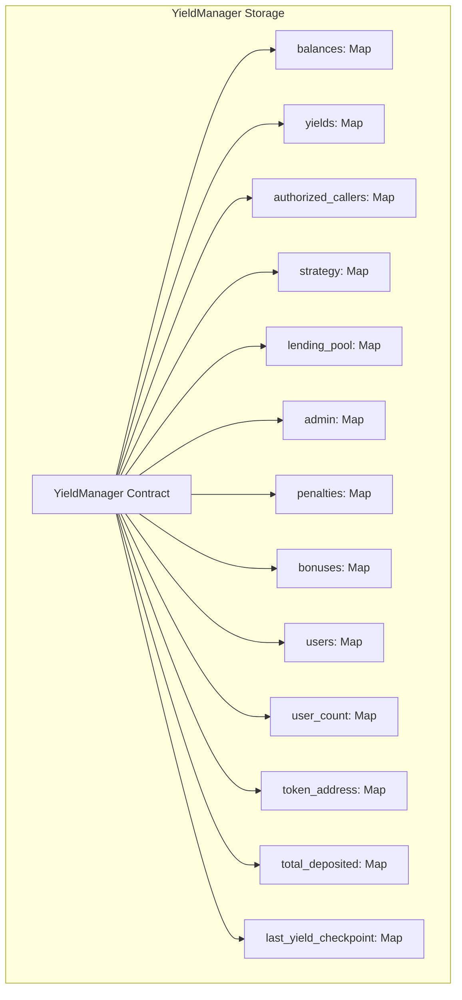
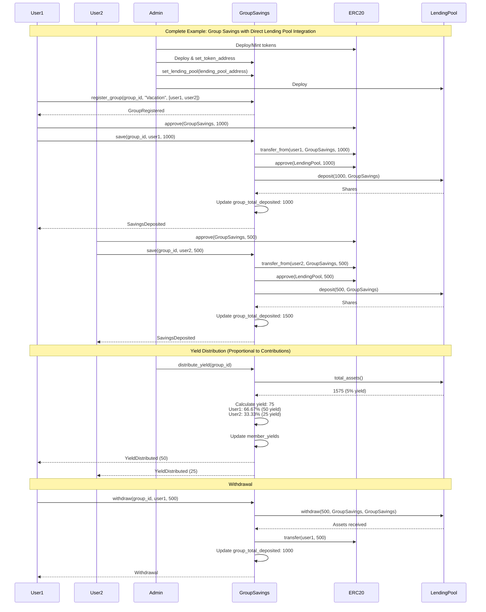

# Alcancia Contract Workflows and Interactions

This document provides visual diagrams of how each contract works and how they interact with each other.

## System Architecture Overview



## GroupSavings Contract Workflow



## YieldManager Contract Workflow



## IndividualSavings Contract Workflow

```mermaid
sequenceDiagram
    participant Owner
    participant IndividualSavings
    participant ERC20
    participant LendingPool
    
    Note over Owner,LendingPool: Setup Phase
    Owner->>IndividualSavings: set_token_address(token_address)
    IndividualSavings-->>Owner: TokenAddressSet event
    Owner->>IndividualSavings: set_lending_pool(lending_pool_address)
    IndividualSavings-->>Owner: LendingPoolSet event
    
    Note over Owner,ERC20: Create Goal Workflow
    Owner->>IndividualSavings: create_savings_goal(goal_id, target_amount, deadline, description)
    IndividualSavings->>IndividualSavings: Validate goal doesn't exist<br/>Validate target > 0<br/>Validate deadline in future
    IndividualSavings->>IndividualSavings: Store goal data<br/>Initialize penalties/bonuses to 0
    IndividualSavings-->>Owner: GoalCreated event
    
    Note over Owner,LendingPool: Deposit Workflow
    Owner->>ERC20: approve(IndividualSavings, amount)
    ERC20-->>Owner: Approval confirmed
    Owner->>IndividualSavings: deposit(goal_id, amount)
    IndividualSavings->>IndividualSavings: Validate goal exists<br/>Verify caller is owner<br/>Check goal not completed
    IndividualSavings->>ERC20: transfer_from(owner, contract, amount)
    ERC20-->>IndividualSavings: Tokens transferred
    alt Lending Pool Configured
        IndividualSavings->>ERC20: approve(lending_pool, amount)
        IndividualSavings->>LendingPool: deposit(amount, contract)
        LendingPool-->>IndividualSavings: Shares received
        IndividualSavings->>IndividualSavings: Update goal_total_deposited
        IndividualSavings-->>Owner: TokensDepositedToPool event
    end
    IndividualSavings->>IndividualSavings: Update goal_current_amounts
    IndividualSavings-->>Owner: Deposit event
    IndividualSavings-->>Owner: ProgressUpdated event
    alt Goal Target Reached
        IndividualSavings->>IndividualSavings: Mark goal as completed
        IndividualSavings-->>Owner: GoalCompleted event
    end
    
    Note over Owner,LendingPool: Withdraw Workflow
    Owner->>IndividualSavings: withdraw(goal_id, amount)
    IndividualSavings->>IndividualSavings: Validate goal exists<br/>Verify caller is owner<br/>Check goal not completed<br/>Check sufficient funds
    alt Lending Pool Configured
        IndividualSavings->>LendingPool: withdraw(amount, contract, contract)
        LendingPool-->>IndividualSavings: Assets received
        IndividualSavings->>IndividualSavings: Update goal_total_deposited
        IndividualSavings-->>Owner: TokensWithdrawnFromPool event
    end
    IndividualSavings->>ERC20: transfer(owner, amount)
    ERC20-->>Owner: Tokens transferred
    IndividualSavings->>IndividualSavings: Update goal_current_amounts
    IndividualSavings-->>Owner: Withdrawal event
    IndividualSavings-->>Owner: ProgressUpdated event
    
    Note over Owner,ERC20: Complete Goal Workflow
    Owner->>IndividualSavings: complete_goal(goal_id)
    IndividualSavings->>IndividualSavings: Validate goal exists<br/>Verify caller is owner<br/>Check goal not already completed<br/>Check target reached
    IndividualSavings->>IndividualSavings: Mark goal as completed
    IndividualSavings-->>Owner: GoalCompleted event
    
    Note over Owner,ERC20: Penalty/Bonus Workflow
    Owner->>IndividualSavings: apply_penalty(goal_id, penalty_amount)
    IndividualSavings->>IndividualSavings: Validate goal exists<br/>Verify caller is owner
    IndividualSavings->>IndividualSavings: Update goal_penalties
    IndividualSavings-->>Owner: PenaltyApplied event
    
    Owner->>IndividualSavings: apply_bonus(goal_id, bonus_amount)
    IndividualSavings->>IndividualSavings: Validate goal exists<br/>Verify caller is owner
    IndividualSavings->>IndividualSavings: Update goal_bonuses
    IndividualSavings-->>Owner: BonusApplied event
```



## Contract Interaction Patterns



## State Management Diagrams

### GroupSavings State Structure



### YieldManager State Structure



### IndividualSavings State Structure

```mermaid
graph TB
    subgraph "IndividualSavings Storage"
        IS[IndividualSavings Contract]
        IS --> GO[goal_owners: Map<goal_id, owner>]
        IS --> GT[goal_targets: Map<goal_id, target>]
        IS --> GD[goal_deadlines: Map<goal_id, deadline>]
        IS --> GDESC[goal_descriptions: Map<goal_id, description>]
        IS --> GCA[goal_current_amounts: Map<goal_id, amount>]
        IS --> GCT[goal_created_at: Map<goal_id, timestamp>]
        IS --> GC[goal_completed: Map<goal_id, bool>]
        IS --> GP[goal_penalties: Map<goal_id, penalty>]
        IS --> GB[goal_bonuses: Map<goal_id, bonus>]
        IS --> UG[user_goals: Map<<user, index>, goal_id>]
        IS --> UGC[user_goal_counts: Map<user, count>]
        IS --> OW[owner: Map<(), address>]
        IS --> TA[token_address: Map<(), address>]
    end
```

## Complete System Flow Example



## Key Design Patterns

### 1. Token Approval Pattern
All contracts require users to approve token spending before deposits:
```
User → ERC20.approve(contract, amount) → Contract.deposit(...)
```

### 2. Authorized Caller Pattern
YieldManager uses an authorization system to allow only trusted contracts to deposit:
```
Admin → YieldManager.set_authorized_caller(contract, true)
AuthorizedContract → YieldManager.deposit(from, user, amount)
```

### 3. Yield Distribution Pattern
YieldManager calculates yield from lending pool and distributes proportionally:
```
YieldManager → LendingPool.total_assets() → Calculate yield
→ For each user: (yield * user_balance) / total_deposited
→ Apply bonuses/penalties → Update user yield
```

### 4. Group Membership Validation
GroupSavings validates membership before allowing operations:
```
User → GroupSavings.save(group_id, member, amount)
→ Validate: group exists, caller == member, member in group
```

### 5. Goal Completion Pattern
IndividualSavings automatically completes goals when target is reached:
```
User → IndividualSavings.deposit(goal_id, amount)
→ Update current_amount
→ If current_amount >= target_amount: complete_goal()
```

## Security Considerations

1. **Access Control**: All contracts use admin/owner checks for configuration
2. **Input Validation**: All functions validate inputs (non-zero amounts, valid addresses, etc.)
3. **Balance Checks**: Withdrawals always check sufficient balance before transfer
4. **Authorization**: YieldManager requires explicit authorization for deposits
5. **Group Validation**: GroupSavings validates membership before operations
6. **Goal Ownership**: IndividualSavings verifies goal ownership for all operations

